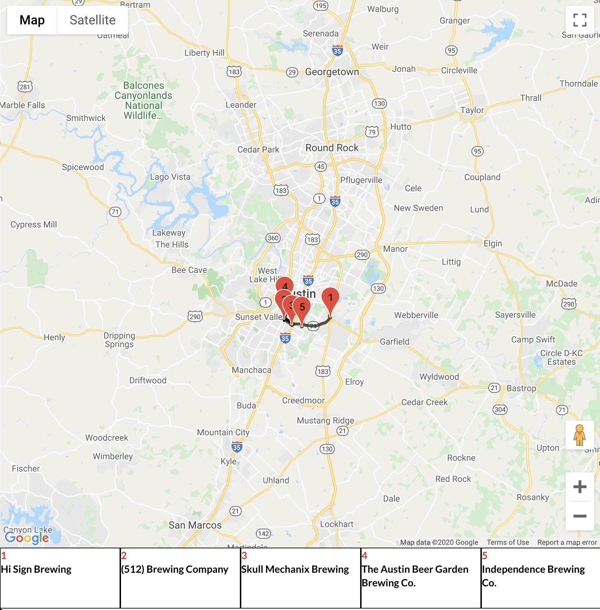

# Pints-Shells
A User-friendly platform to locate breweries in and around Austin, TX and also give locations to nearby places to get tacos

## Link to Site - Deployed
https://atx-brews-taste.firebaseapp.com/

## Languages Used
- HTML
- CSS
- JavaScript
- JSX

## APIs Used:
- Google Maps
- Google Places
- Cloud Functions

### FRONTEND
- Reactjs
- HTML
- CSS
- Semantic-ui-css
- Bootstrap
- Reactstrap

### DATABSE
- Google Firestore

### BACKEND: SERVERLESS
- firebase cloud functions
- Nodejs

## Demo

### Dependencies
  -"@sweetalert/with-react": "^0.1.1",
  -"@testing-library/jest-dom": "^4.2.4",
  -"@testing-library/react": "^9.5.0",
  -"@testing-library/user-event": "^7.2.1",
  -"firebase": "^7.16.1",
  -"google-maps-react": "^2.0.6",
  -"js-cookie": "^2.2.1",
  -"prop-types": "^15.7.2",
  -"react": "^16.13.1",
  -"react-dom": "^16.13.1",
  -"react-facebook-login": "^4.1.1",
  -"react-form-login": "^1.1.4",
  -"react-google-maps": "^9.4.5",
  -"react-router-dom": "^5.2.0",
  -"react-scripts": "^3.4.1",
  -"reactstrap": "^8.5.1",
  -"recompose": "^0.30.0",
  -"semantic-ui-css": "^2.4.1",
  -"semantic-ui-react": "^0.88.2",
  -"sweetalert": "^2.1.2"

